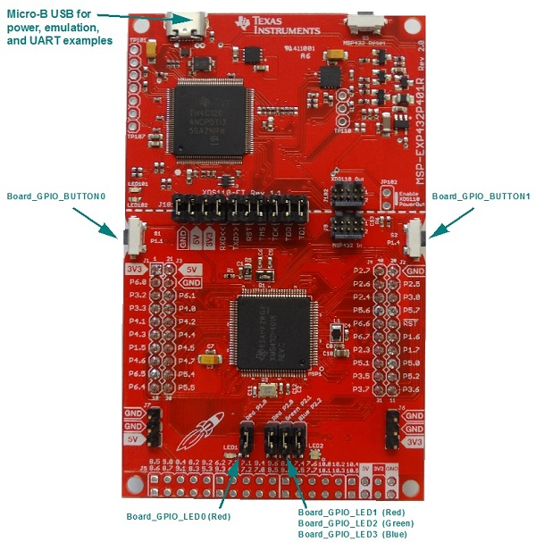

# MSP-EXP432P401R Settings and Resources

The MSP-EXP432P401R board contains an MSP432P401R device.

## Jumper Settings

* Set __RXD &lt;&lt;__ and __TXD &gt;&gt;__ to provide UART communications via the onboard USB debugger.
* If you use a BoosterPack with this board, the BoosterPack fits over J1 and J2.

## Board resources used in driver examples

The following table lists the Board names of the resources used by
the driver examples, and their corresponding pins.  Note that there may be
other resources configured in the board files that are not used by any
driver example.  Only the example resources are listed in the table.

  |Board Resource|Pin|
  |--------------|:---|
  |`Board_ADC0`|P5.5  (Connect to analog signal)|
  |`Board_ADC1`|P5.4  (Connect to analog signal)|
  |`Board_ADCBUF0CHANNEL0`|P5.5  (Connect to analog signal)|
  |`Board_ADCBUF0CHANNEL1`|P5.4  (Connect to analog signal)|
  |`Board_CAPTURE0`|P7.7|
  |`Board_CAPTURE1`|P6.7|
  |`Board_GPIO_LED0`|P1.0  (Red P1.0 must be jumpered)|
  |`Board_GPIO_LED1`|P2.0  (Red P2.0 must be jumpered)|
  |`Board_GPIO_BUTTON0`|P1.1|
  |`Board_GPIO_BUTTON1`|P1.4|
  |`Board_I2C0`|P1.6, P1.7 (Some I2C examples require Booster packs)|
  |`Board_I2CSLAVE0`|P1.6, P1.7|
  |`Board_PWM0`|P2.1  (Green P2.1 must be jumpered)|
  |`Board_PWM1`|P2.2  (Blue P2.2 must be jumpered)|
  |`Board_SPI0`|P1.5, P1.6, P1.7, P1.4|
  |`Board_SPI1`|P3.5, P3.6, P3.7, P3.4|
  |`Board_UART0`|P1.2, P1.3 UART provided through emulation (__RXD &lt;&lt;__ and __TXD &gt;&gt;__ must be jumpered)|

## Booster packs

The following examples require booster packs.

  |Example|Booster Pack|
  |-------|:------------|
  |fatsd|[microSD Card BoosterPack](http://boardzoo.com/index.php/boosterpacks/microsd-boosterpack.html#.WBjQnXr9xv4) or [SD Card BoosterPack](http://store.43oh.com/index.php?route=product/product&path=64&product_id=66)|
  |fatsdraw|[microSD Card BoosterPack](http://boardzoo.com/index.php/boosterpacks/microsd-boosterpack.html#.WBjR0nr9xv4) or [SD Card BoosterPack](http://store.43oh.com/index.php?route=product/product&path=64&product_id=66)|
  |i2ctmp007|[BOOSTXL-SENSORS Sensors BoosterPack](http://www.ti.com/tool/boostxl-sensors)|
  |portable|[BOOSTXL-SENSORS Sensors BoosterPack](http://www.ti.com/tool/boostxl-sensors)|
  |i2ctpl0401evm|[TPL0401 EVM board](http://www.ti.com/tool/tpl0401evm)|

## ADC examples pin connections

The ADC examples sample input from the A0 and A1 pins.  These pins should
be connected to the analog input.  For quick testing, the A0 pin can be
connected to 3V3 and A1 to ground.

  |ADC Pin (Function)||Analog input|
  |------------------|-|:-----------|
  |P5.5 (A0)|-->|3V3|
  |P5.4 (A1)|-->|GND|

## I2C Master/Slave example pin connections

The I2C master and slave examples require two MSP432 boards, one running
the master example and the other running the slave example.  These should
be connected as follows:

  |Master Pin (Function)| |Slave Pin (Function)|
  |---------------------|-|:--------------------|
  |P1.6 (EUSCI_B0_SIMO)|-->|P1.6 (EUSCI_B0_SIMO)|
  |P1.7 (EUSCI_B0_SOMI)|-->|P1.7 (EUSCI_B0_SOMI)|
  |GND|-->|GND|

## SPI Loopback example pin connections

When wiring for SPI loopback, pins on a single board are wired to other
pins on the same board.

  |Master Pin (Function)| |Slave Pin (Function)|
  |---------------------|-|:--------------------|
  |P1.5 (EUSCI_B0_CLK)|-->|P3.5 (EUSCI_B1_CLK)|
  |P1.6 (EUSCI_B0_SIMO)|-->|P3.6 (EUSCI_B1_SIMO)|
  |P1.7 (EUSCI_B0_SOMI)|-->|P3.7 (EUSCI_B1_SOMI)|

## SPI Loopback 4 wire example pin connections

When wiring for SPI loopback 4 wire example, pins on a single board are
wired to other pins on the same board.

  |Master Pin (Function)| |Slave Pin (Function)|
  |---------------------|-|:--------------------|
  |P2.5 (EUSCI_A1_CLK)|-->|P3.5 (EUSCI_B2_CLK)|
  |P2.6 (EUSCI_A1_SIMO)|-->|P3.6 (EUSCI_B2_SIMO)|
  |P2.7 (EUSCI_A1_SOMI)|-->|P3.7 (EUSCI_B2_SOMI)|
  |P2.3 (EUSCI_A1_STE)|-->|P2.4 (EUSCI_B2_STE)|

## Peripherals Used

The following list shows which MSP_EXP432P401R peripherals are used by
driver and kernel applications. Driver examples control which peripherals (and which ports) are used.

* __TI-RTOS Kernel (SYS/BIOS).__ Uses the first general-purpose timer available and that timer's associated interrupts. Generally, this will be Timer\_A0. The TI-RTOS Kernel manages the interrupt controller statically without an interrupt dispatcher.
* __Drivers.__
    * __I2C:__ The I2C driver is configured on EUSCI_B0 to support various BoosterPacks.
    * __PWM:__ The PWM driver uses the onboard RGB LED (G:P2.1 and B:P2.2). These pins are configured for the PWM driver. While these pins can also be used by the GPIO driver, your application's board file must ensure that the pins are not simultaneously used by the GPIO and PWM drivers.
    * __SD Card:__ Uses FatFs and the SDSPI driver on EUSCI_B0 without interrupts to read and write to files.
    * __SPI:__ The SPI driver is configured to use EUSCI_B0 and EUSCI_B1 for SPI communications.
    * __Timer:__ The Timer, PWM and Capture driver use the timer peripheral.
    * __UART:__ The UART driver uses EUSCI_A0, which is attached to the onboard emulator to facilitate serial communications.
    * __Watchdog:__ The Watchdog driver example uses the Watchdog Timer peripheral.
